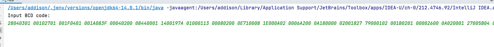

# LZ4解压缩程序（java)

## 本程序是陈峰撰写的《clickhouse架构与源码解析》专栏的示范程序

## 欢迎点击阅读

## 请点击[传送门](https://www.zhihu.com/column/c_1384650064271351808) 
## 求关注点赞。谢谢

### 运行步骤

- 导入IDEA
- 运行App.java中的main函数
- 将LZ4压缩后的数据直接粘贴到控制台，按回车（需要粘贴BCD码）
- 解压缩的结果会写入项目目录的archive.txt中
- 解压结果有可能也是二进制的，因此推荐使用winhex或hex friend打开
### 注意
- 项目目录中的bcd_source_code.txt,就是教程中复制出来的数据，可以直接使用
- 项目目录中的archive.txt是教程中第一个block块解压缩后的数据

